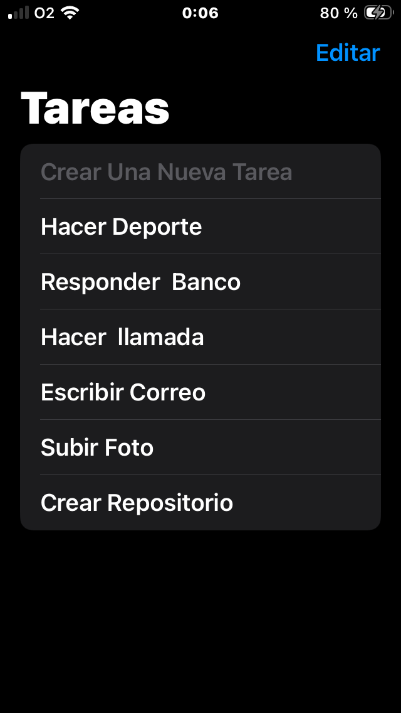
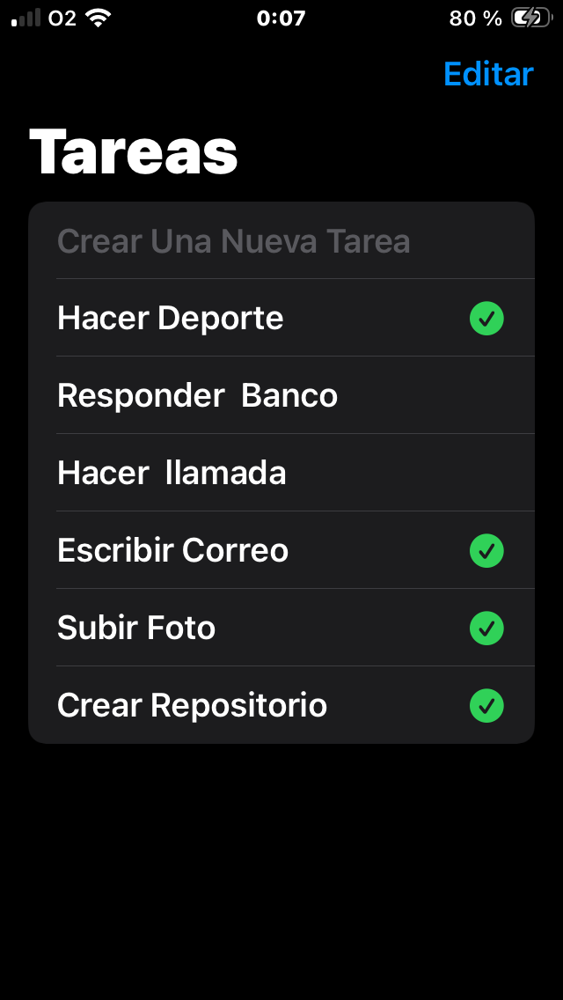
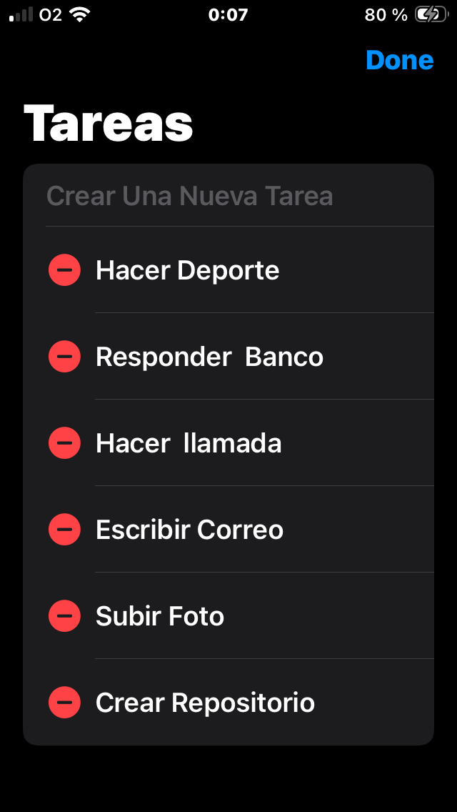

# 📱 App de Tareas - SwiftUI

  
  
  

Esta es una aplicación nativa para iOS diseñada para la gestión eficiente de tareas diarias. El proyecto demuestra el uso de interfaces declarativas y una arquitectura limpia.

## 🛠️ Tecnologías utilizadas
* **Lenguaje:** Swift 5.10
* **Framework:** SwiftUI & Combine.
* **Patrones de Diseño:** MVVM, Inyección de Dependencias y **Property Wrappers** personalizados.
* **Comunicación entre Vistas:** Uso avanzado de **@Binding** y **@EnvironmentObject**.
* **Persistencia:** Almacenamiento en **UserDefaults** con soporte para **Codable (JSON)**.

## ✨ Funcionalidades
* **Ciclo CRUD Completo:** Creación, visualización, edición de títulos y eliminación de tareas.
* **Interfaz Inteligente:** Modos dinámicos de visualización y edición que optimizan la interacción del usuario.
* **Persistencia Real:** Sincronización transparente de datos que garantiza que la información se mantenga tras el cierre de la app.
* **Experiencia Nativa:** Implementación de SF Symbols, feedback visual de estados y soporte para Modo Oscuro/Claro.

## 👨‍💻 Autor
**Alfredo Hidalgo** - iOS Developer.
